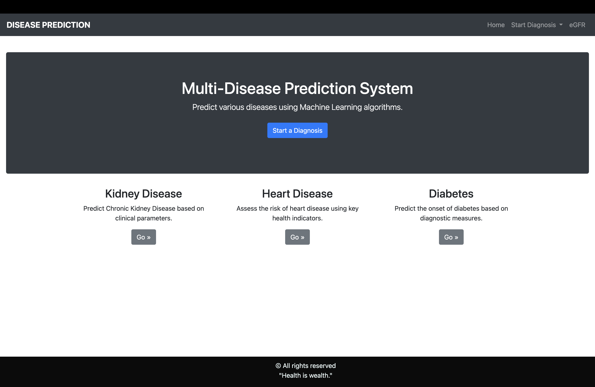
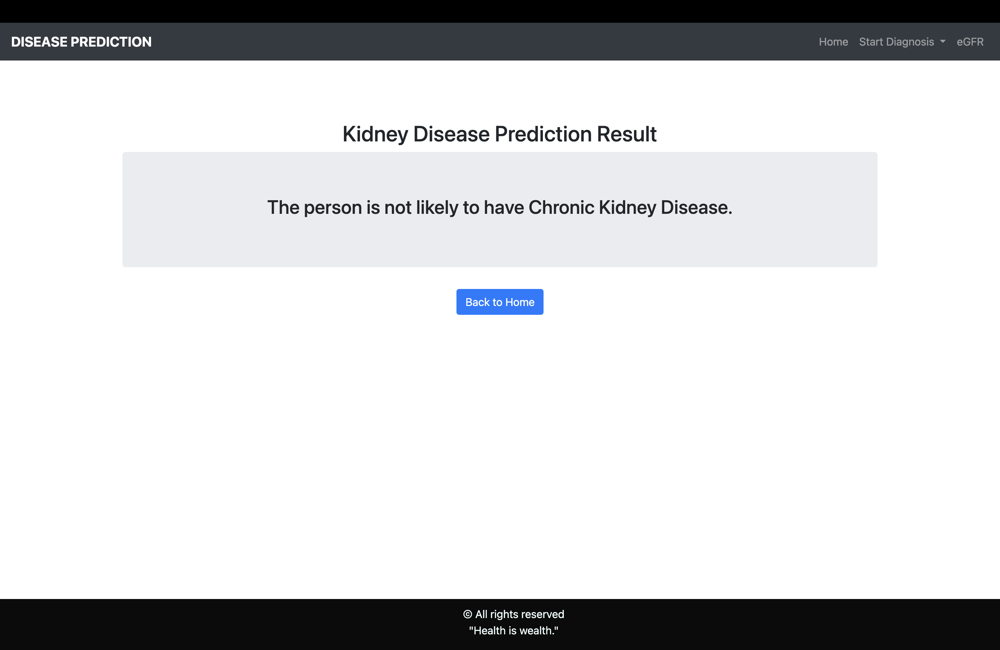

# Multi-Disease Prediction System

A comprehensive web application built with **Flask** and **Machine Learning** to predict the likelihood of various diseases based on clinical parameters.

## 📌 Project Overview

This application serves as a diagnostic aid, allowing users to input medical data and receive instant predictions. It currently features a fully functional **Chronic Kidney Disease (CKD)** prediction model, with placeholders for future integration of Heart Disease, Diabetes, Liver Disease, Breast Cancer, Malaria, and Pneumonia prediction models.

## 🚀 Features

-   **Kidney Disease Prediction**: Uses a trained Machine Learning model (`kidney.pkl`) to predict CKD risk with high accuracy.
-   **User-Friendly Interface**: Clean and responsive UI built with Bootstrap.
-   **Extensible Architecture**: Modular design allowing easy addition of new disease prediction models.

## 🛠️ Tech Stack

-   **Backend**: Python, Flask
-   **Machine Learning**: Scikit-learn, Pandas, NumPy
-   **Frontend**: HTML, CSS, Bootstrap
-   **Templating**: Jinja2

## 📂 Project Structure

```
CKD-B.TECH/
├── README.md           # Project documentation
├── requirements.txt    # Python dependencies
├── assets/             # Project assets (screenshots, etc.)
├── images/             # Additional images
├── models/             # Directory for storing ML models
└── src/                # Source code directory
    ├── app.py          # Main Flask application entry point
    ├── kidney.pkl      # Trained Kidney Disease model
    └── templates/      # HTML templates for the web interface
```

## 💻 Installation & Setup

Follow these steps to set up and run the project locally.

### Prerequisites

-   Python 3.8 or higher
-   pip (Python package installer)

### 1. Clone the Repository

```bash
git clone https://github.com/Karthi-blip/CKD-B.TECH.git
cd CKD-B.TECH
```

### 2. Create a Virtual Environment (Recommended)

It's best practice to use a virtual environment to manage dependencies.

**macOS/Linux:**
```bash
python3 -m venv ckd-env
source ckd-env/bin/activate
```

**Windows:**
```bash
python -m venv ckd-env
ckd-env\Scripts\activate
```

### 3. (Optional) Upgrade pip

Keeping pip current helps avoid install issues, especially on macOS.

```bash
python3 -m pip install --upgrade pip
```

### 4. Install Dependencies

```bash
pip install -r requirements.txt
```

This pulls in Flask, scikit-learn, pandas, TensorFlow and all other runtime dependencies.

## 🏃‍♂️ Usage

To run the application, you must execute the `app.py` file from within the `src` directory to ensure the model loads correctly.

1.  Navigate to the `src` directory:
```bash
cd src
```

2.  Run the Flask application (from inside `src/` so `kidney.pkl` can be found):
```bash
python3 app.py
```

3.  Open your web browser and go to:
```
http://127.0.0.1:5000/
```

## 📸 Screenshots

### Home Page


### Prediction Result


## ⚠️ Note on Static Assets

The application templates reference a `static` directory for images (e.g., logos). Ensure that a `static` folder exists in `src/` containing the necessary assets (like `logo1.png`) for them to display correctly.

## 🤝 Contributing

Contributions are welcome! Please fork the repository and submit a pull request.

## 📄 License

This project is open-source and available for educational purposes.